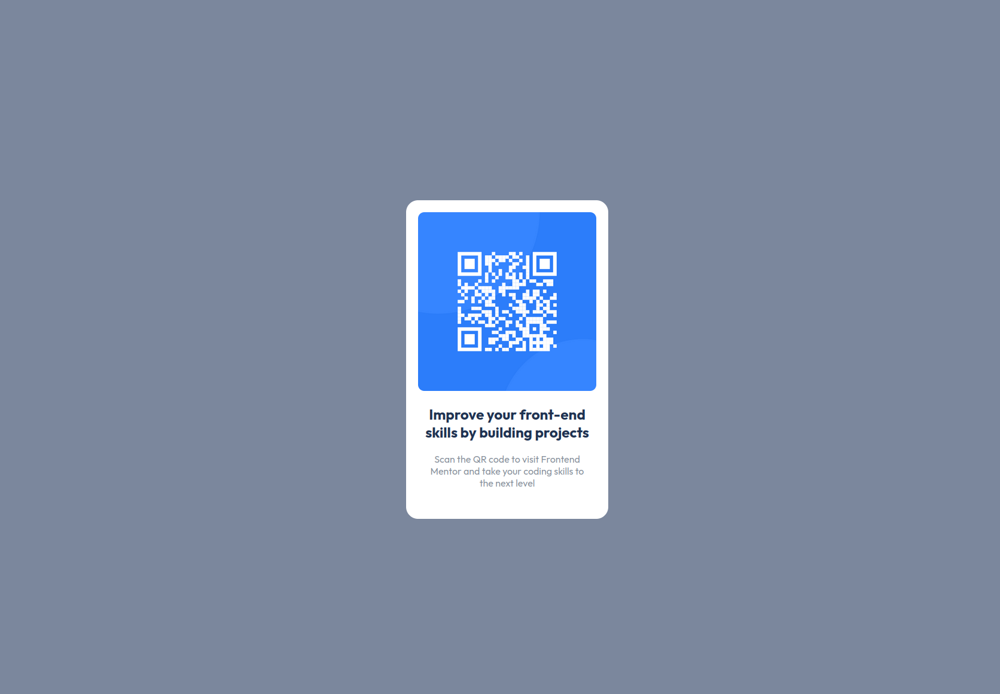

# Frontend Mentor - QR Code Component Solution

This is a solution to the [QR code component challenge on Frontend Mentor](https://www.frontendmentor.io/challenges/qr-code-component-iux_sIO_H). Frontend Mentor challenges help you improve your coding skills by building realistic projects. 

## Table of contents

- [Overview](#overview)
  - [Screenshot](#screenshot)
  - [Links](#links)
- [My process](#my-process)
  - [Built with](#built-with)
  - [Continued development](#continued-development)
  - [Useful resources](#useful-resources)
- [Author](#author)

## Overview

### Screenshot

### Links

- Solution URL: [Please view my solution.](https://mreyna12.github.io/QRCode/)

## My process

### Built with

- HTML5
- CSS3

### Continued development

For future projects, I would like to focus on responsive web design in order to ensure visibility across a variety of devices and windows/screen sizes.

### Useful resources

- [freeCodeCamp Article](https://www.freecodecamp.org/news/html-page-width-height/) - This is a very helpful article that discusses how to set width and height for full page size. I often times would have issues with making pages full-sized and the result would include a verticle scroll bar. I was able to eliminate the vertical scroll bar but still maintain a full-sized web page.

## Author

- Frontend Mentor - [@MReyna12](https://www.frontendmentor.io/profile/MReyna12)
- Twitter - [@Fraktionn](https://twitter.com/Fraktionn)
- LinkedIn - [@michaelpreyna](https://www.linkedin.com/in/michaelpreyna/)
